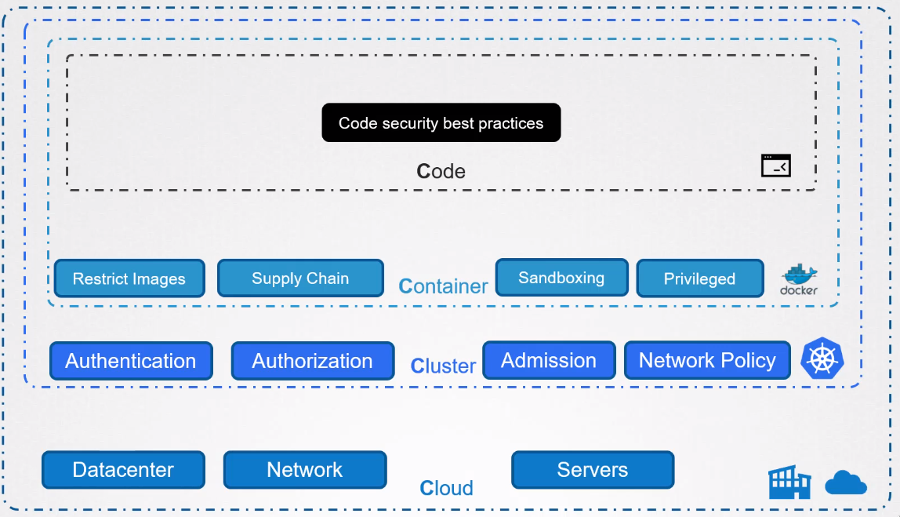
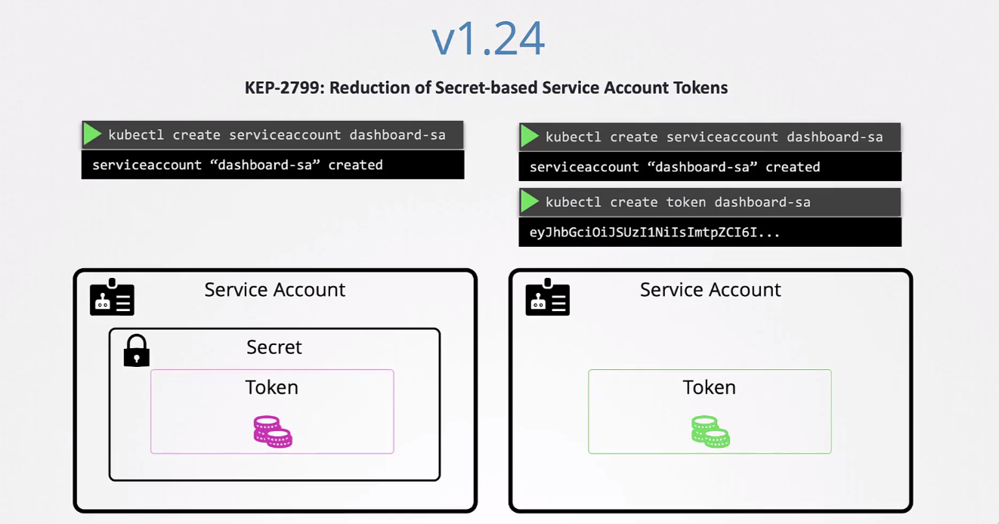
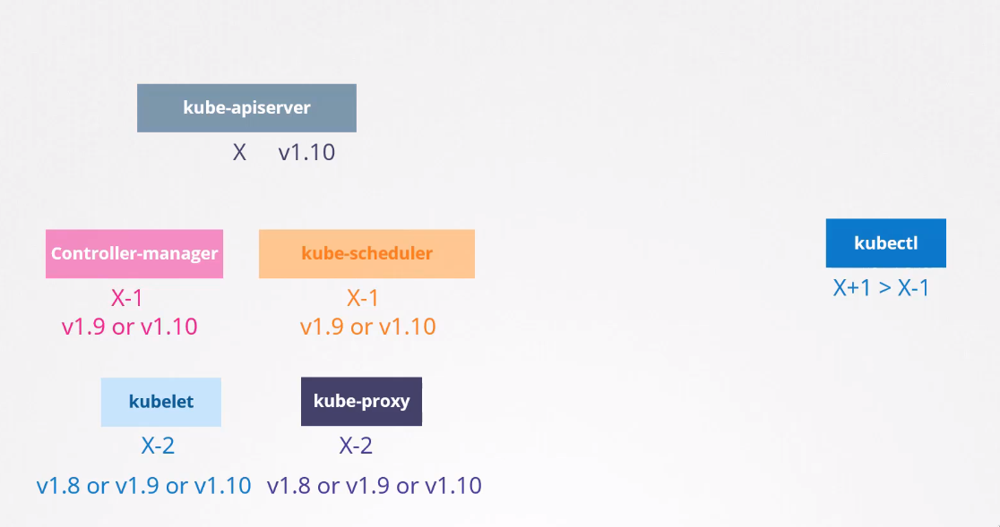

# Table of contents
1. [Understanding K8S Attack Surfaces](#attack)
	1. [The 4 C'S ](#4c's)
2. [Cluster Setup](#cluster)
	1. [CIS benchmark](#cis)
	2. [Security Primitives](#securityprimitives)
	3. [Authentication](#auth)
	4. [TLS Certificates](#cert)
	5. [KubeConfig File](#kubeconfig)
	6. [API Groups](#API)
	7. [Authorization](#autho)
	8. [Securing](#security)
	9. [ kubectl proxy](#proxy)
	10. [ Dashboard](#dashboard)
	11. [platform binary](#binary)
	12. [releases and versions](#release)
	13. [ network policy](#policy)
	14. [ingress](#ingress)
	15. [docker config and security](#docserv)
3. [System Hardening](#system)
	1. [latest privilege](#privilege)
	2. [reduce surface attack](#surfattack)
4. [Minimizing Microservice Vulnerability](#minimize)
	1. [security context](#seccont)
	2. [admission controllers](#admcont)
	3. [pod security](#podsec)
	4. [open policy agent](#opa)
	5. [manage k8s secrets](#k8ssecrete)
	6. [container sandboxing](#sandbox)
	7. [container runtime](#containerruntime)
	8. [pod to pod encryption](#mtls)
5. [Supply Chain](#chain)
	1. [ minimize base image footprint](#footprint)
	2. [ image policy](#imagepolicy)
	3. [static analysis](#staticanal)
	4. [scan image](#scaimage)
6. [Monitoring, Logging and Runtime Security](#watch)
	1. [behavioral analysis](#behavior)
	2. [immutable containers](#immucont)
	3. [audit logs](#audit)

## Understanding k8s attack surfaces <a name="attack"></a>

### the 4C's of cloud native security <a name="4c's"></a>



---

## Cluster setup && Hardening <a name="cluster"></a>

### CIS benchmark (center for internet security) <a name="cis"></a>
- [cis](https://www.cisecurity.org/cis-benchmarks)
	- using cis cat tool to run assessment on ubuntu. 
	```sh
		sh ./Assessor-CLI.sh -i -rd /var/www/html/ -nts -rp index
	```
	- when you run the script you will have a full report you can use, to fix your server 
	- 
- kube-bench tool
	-  open source tool from [aqua](https://github.com/aquasecurity/kube-bench) security. 
---

### Security primitives <a name="securityprimitives"></a>
- kube-apiserver (the first line of defense)
	-  who can access the cluster ? AUTHENTICATION
		-  Files (user & password OR user & token)
		-  LDAP (external authentication provider)
		-  certifacter
		-  service accounts
	-  what can they do? AUTHORIZATION
		-  RBAC 
		-  ABAC 
		-  Node 
		-  web hook

---
### Authentication <a name="auth"></a>
- who access cluster?
	-  adminstrator ( user )
	-  developer ( user )
	-  service bot ( service account )
	-  end user ( managed by application)
- talking about user account 
	- using (user and password) pass this file to api-server yaml file in /etc/kubernetes/manifests/kubeapi-server.yaml 
- talking about service account
	-  we create service account to give an application access.
	```sh
	kubectl create serviceaccount 
   ```
   
---
### TLS certificate <a name="cert"></a>

- we need to know why and how we configure tls ? 
	- gurante trust between 2 parts during transactions.
	- make it encrypted 
-  symmetric encryption
	- use the same key for encrypt and decrypt
- Asymmetric encryption
	- use private and public key 
	-  we create the private and puplic key pair using **openssl** 
	we use Asymmetric first to trasfer the symmetric key 
- 3 types of certificates
	-  root cert
	-  client cert
	-  server cert
	#### scenario
	- when sever send to us the public key, it sends it with certificate. every one can assign himself a certificate called himself anyone he want to be, but we can know who issued the certificate, so now we need **certificate authority CA** like *symantec, digicert and globalSign*  we send **CSR certificate sign request**, all this is know as ***PKI*** **public key infrastructure** 
- TLS for K8S

- How to generate certificate for the cluster?
	- There are many tools **openssl, Easyrsa,Cfssl**
		-  Generate key 
		-  Certificate sign request
		-  Sign Certificates
-  to deal with tls certificate in K8S cluster you need to know how the cluster was build
	-  hard way 
	- kubeadm
	-  check if all cert is worked well, download this excel [sheet](https://github.com/mmumshad/kubernetes-the-hard-way/tree/master/tools)
- **Certificate API** 
	-  ***controller manager*** is responsible for all certificate operations
	-  talk about sign the certificate [link](https://kubernetes.io/docs/reference/access-authn-authz/certificate-signing-requests/#signer-api)
---
### Kube config <a name="kubeconfig"></a>
- **$HOME/.kube/config** this is the place for your config file as usual.
- kube config file has ***3*** sections
	-  clusters
	-  context
	-  users


---
### API Groups <a name="API"></a>
#### api


#### apis 


#### Note : you can use kubectl proxy 
- it will start server on port 8001 and will use the certificate from kube config file on local.
---
### Authorization <a name="autho"></a>
- give user or developer some power to create, delete, update things in cluster.
- you can do authorization using
	-  RBAC
	-  ABAC 
	-  WEB HOOK
	-  NODE 
- authorization mode 
	-  always deny
	-  always allow
	#### Note : you can use multiple authorization mode, it will be execute by the order you put in.
- RBAC 
	-  define **role**  object  to a user or developer 
	-  define **role binding** object and attach developer to the role
	-  role and role binding are ***name spaces*** 
	you can check if you can access thing in cluster by this command
	```sh
	kubectl auth can-i  create-deployments --as dev-user
  ```
	- cluster role and cluster role binding 
-  Resources in K8S are nither namespaced nor cluster scoped  
     ```sh
     kubectl api-resources --namespaced=true 
	 kubectl api-resources --namespace=false
	 ```
--- 
### securing the kubelet <a name="security"></a>
- how to secure communication between **kubelet** on the ship with **api-server** on master ship.
	- if you asked about kubelet ?
		-  you should know the location of config file 
			-   oftetn is in **/var/lib/kubelet/config.yaml** 
	-  kubelet works on **2** ports
		-  10250
		-  10255
	-  you can work on the security of kubelet authentication using 
		-  --anonymous-auth = false 
		-  you can enable one of these two 
			-  certificate auth (x509)
			-  API Bearere Tokens
	-  you can work on the security of kubelet authorization using 
		-  --authorization-mode = **AlwaysAllow** change it to **webhook**
---
### kubectl proxy <a name="proxy"></a>
- we use kubectl proxy to run proxy on our local laptop to proxy all trafic to the cluster, so we can access service inside the cluster using this proxy.
 


- kubectl port-forward service/nginx  28080:80
---
### K8S dashboard <a name="dashboard"></a>
- talk about install it using the K8S docs, expose it and use token to login
---
### Verify platform binaries before <a name="binary"></a>
- It is important to verify that the downloaded binaries are safe to use by comparing against the checksum hash found in the main page.
- if anything changed in the binary you can know by comparing the hash 
--- 
### K8S releases and versions<a name="release"></a>


#### cluster update process
- K8S support at least **3** minor versions
- None of the other components in control plane components should ever be at a version higher than the kube API server.


#### scenario for upgrading K8S clustere
```sh
# in the control plane
kubectl get nodes # to know the version of the cluster
kubeadm upgrade plan # to see the latest stable versions, look at remote version
# We will be upgrading the controlplane node first. Drain the controlplane node of workloads and mark it `UnSchedulable`
kubectl drain controlplane
kubectl drain controlplane --ignore-daemonsets
```

On the `controlplane` node, run the following commands:

>This will update the package lists from the software repository.

```sh
apt update
```

>This will install the kubeadm version 1.26.0

```sh
apt-get install kubeadm=1.26.0-00
```

>This will upgrade Kubernetes controlplane node.

```sh
kubeadm upgrade apply v1.26.0
```

>This will update the `kubelet` with the version `1.26.0`.

```sh
apt-get install kubelet=1.26.0-00 
```

>You may need to reload the `daemon` and restart `kubelet` service after it has been upgraded.
```sh
systemctl daemon-reload
systemctl restart kubelet
```

> after that make control plane scheduled again

```sh 
kubectl uncordon controlplane
```

Going to upgrade worker node 
> in control plane make worker node (node1) unscheduled

```sh
kubectl drain node01 --ignore-daemonsets
# ssh to worker node
ssh node01
# update packages
apt update
# install kubeadm expect version
apt-get install kubeadm=1.26.0-00
# upgrade node
kubeadm upgrade node
# insall kubelet
apt-get install kubelet=1.26.0-00
# reload daemon and restart kubelet
systemctl daemon-reload 
systemctl restart kubelet
```

---
### Network policy && security  <a name="policy"></a>
> you use network policy to prevent and allow traffic as you want in specific name space, **note that not all network solution support network policy** 

- talk about ingress and igress rules 

--- 
### Ingress <a name="ingress"></a>


#### ingress controller
- we need to create 
	- deployment to create pod with specific image
	- sevice  to expose the ingress controller to outside
	- config  to store the information 
	- service account to make ingress controller be able to monitor the cluster

#### ingress resources
> is a set of rules and confiuration apply on the ingress controllers

#### scenario to implement ingress controller and resources in K8S cluser
```sh
# add namespace 
k create ns ingress-nginx
# creating config map for nginx controller 
k -n ingress-nginx create configmap  ingress-nginx-controller
# create two service account 
k -n ingress-nginx create serviceaccount ingress-nginx
k -n ingress-nginx create serviceaccount ingress-nginx-admission
# We need to create the Roles, RoleBindings, ClusterRoles, and ClusterRoleBindings for the ServiceAccount. 
```

--- 
### Docker service configuration && Securing the daemon<a name="docserv"></a>
> you can use **dockerd  --debug** to run docker in debug mode 

- when docker daemon starts, it listens on unix socket 
	-  the unix socket is **ipc** , internal process communication mechanism, that use for communication between different process on the same host


- what will happen if you gain the access to docker daemos?
	-   Delete existing container  hostion applications
	-  Delete  volumes
	-  Crypto currency mining
	-  Gain root access on the host by running privilege container

#### authenticate the docker daemon


---
## System Hardening <a name="system"></a>

> this section is so awesome

### Least privilege principle <a name="privilege"></a>
-  Limit access to nodes
-  RBAC  access
-  Remove obolete packages & services 
-  Restrict network access
-  Restrict obsolete kernel modules
-  Identify and fix open ports
---
### Reduce the attack surface<a name="surfattack"></a>
#### limit node access 
- there are 4 types of accounts 
	-  superaccounts like root
	-  user accounts like bob,michle
	-  service accounts llike nginx, http
	-  system accounts like mail, ssh
- some useful command 
```bash 
# useful commands
	id 
	who 
	last
	usermod
	userdel 
# useful file 
	cat /etc/passwd
	cat /etc/shadow
	cat /etc/group
```
#### ssh hardening
> we need to use CIS bech mark for disribution independent linux [benchmark](https://learn.cisecurity.org/benchmarks)
- talk about ssh key generate, copy and how to connect use ssh.
-  edit **/etc/ssh/sshd_config**
#### privilege escalation
- we talk about adding user and adding user to goup
- editting the /etc/sudoers file and permission for group and users
#### Remove unwanted package
- dealing with service and packages 
- if you want to see all service running
	- systemctl list-units --type service --all
#### restricted kernel  modules
- talk about loading module dynamically
- you can load module statically using **modprobe**
- you can list module using **lsmod**
- you can black list module using **/etc/modprobe.d/blacklist.conf**
#### disable open ports
- see all ports
	-  netstat -natp
	-  netstat -an | grep -w listen
- if you want to know in which this port use for 
	-  cat /etc/services | grep -w portNumber
#### minimize iam policies and roles
- talk about cloud provider and root accounts, I'm role and policy.
#### UFW uncomplicated firewall
> we use ufw as interface for iptables

- talk about how to install it 
- talk about how to create,  delete rules and so on.
##### EX  allow trafic from this ip to the port on server 
- ufw allow from  135.22.65.0/24 to any port  9090 proto tcp
-  ufw enable 
#### linux syscalls 
- talk about user space and kernel space 
- how can i trace the syscall used by command using **strace**
	-  strace -c touch /tmp/error.logs -> list all syscalls used by touch command
#### Tracee from aquasec
> tool use to trace syscalls inside **containers** 
- tracee use eBPF ***Extended berkeley packet filter***to trace the system at runtime , that can run program directly inside kernel space without interfering with kernel source code or loading any kernel module 
#### restrict syscall using seccomp
> seccomp used to sandbox application to only use syscalls they need.
- there are **3** mode for syscalls 
	-  0 -> disabled
	-  1 -> strict 
		 - 1.  `read` - for reading data from file descriptors or sockets.
		 - 2.  `write` - for writing data to file descriptors or sockets.
		 - 3.  `exit` - for exiting the process.
		 - 4.  `rt_sigreturn` - for returning from a signal handler.
	- 2 ->  filtered 
#### seccomp in K8s
> kubernetes @v1.20 not implement **seccomp** by default, However, once an effective profile is created and used, it can certainly improve the isolation of our pods and help secure the Kubernetes cluster.

- you can add custom profile for seccomp in this path /var/lib/kubelet/seccomp/profilename.json
#### App Armor
- is a linux security module that confine a program to limited set of resources 
- profile can loaded in 3 different modes
	- enforce
	- complain
	- unconfined
#### App Armor inside K8S cluster
```sh
# to know if the apparmor module is loaded 
aa-status
# load apparmor profile for nginx
apparmor_parser -q /etc/apparmor.d/usr.sbin.nginx
```
#### Linux capabilities
---
## Minimizing microservice vulnerability <a name="minimize"></a>
### security context <a name="seccont"></a>
- you can use security context at `pod level or container level` 
	- the security context at `container level` overwrite which at `pod level`
- you can add capabilities `at container level only`
---
### Admission controllers <a name="admcont"></a>
> help us to implement better security measure to enforce how the cluster is used.

- you can find the file at K8S path edit `kube-apiserver`
- there are **2** types of admission controllers
	-  validating 
	-  mutating
- you can write your admission controllers, which have your code and logic and make mutating  admission webhook refer to it.
#### Note 
> admission controller is so important< this message for **nmn3m** 
---
### Pod security policy <a name="podsec"></a>
- Pod security policies help indefining policies to restrict pods from being created with specific capabilities or privileges.
- one of the admission controllers that come built in K8S is `pod security policy admission controllers`  by default is not **enabled** 
---
### Open policy agent (OPA) <a name="opa"></a>
> OPA takes care of what action that user can do -> authorization

##### need to see this 
[opa deep dive](https://www.youtube.com/watch?v=n94_FNhuzy4)
- talk about how to download opa, how to write policy using `rego programming language`
#### OPA in K8S
- How does OPA know about resources in K8S?
	-   It uses `kube-mgmt` service as sicdecar container along with OPA, replicate source definition from K8S, so they can be cached in OPA. 
##### scenario 
- What needs to be done to enable `kube-mgmt` to automatically identify policies defined in kubernetes and load them into OPA?
	- create config map with label  policy set to rego
---
### Manage K8S secrets <a name="k8ssecrete"></a>
> we use secrets to store sensetive data encoded 

- there are **2** ways to create secrets using:-
	-  declarative 
	-  imperative  
#### Note 
> secrets are encoded not `encrypted`, that mean if anyone have access to them, can decode them.

- [ encrypt data at rest article by K8S docs](https://kubernetes.io/docs/tasks/administer-cluster/encrypt-data/)
---
### Container sandboxing <a name="sandbox"></a>
- talk about isolation in virtual machine **VS** Container
- isolation in container occur using `process id namespace`
- Container use syscall to talk with kernel of the host, so if there any vulnerability, you can access a back door to the host machine like `Dirt Cow` vulnerability 
- What the mean of sandboxing?
	-  any technique that isolate something from the rest of the system like using `seccomp profile or using apparmor profile 
#### gVisor Sandboxing
> gVisor is a tool from google that allows an additional layer of isolation between container and kernel

[gVisor Docs](https://gvisor.dev/docs/)

- not work with all apps, you should test it.
- make more CPU instruction, make container solw.

#### Kata Container
- other sandboxing tool 
- it needs `nested virtualization` , not all cloud provider support that.

---
### Container Runtime <a name="containerruntime"></a>
- there are many container runtime like:-
	-  runc
	- runsc -> gVisor use it.
	- kata-runtime -> use by kata sandbox
- all these runtime compatible with OCI 


#### yaml file for creating runtime class
```yml
apiVersion: node.k8s.io/v1 
kind: RuntimeClass 
metadata: 
  name: secure-runtime 
handler: runsc
```
---
### Implement pod to pod encryption by use of mTLS <a name="mtls"></a>
- we can use third party application like **[Istio](https://istio.io/latest/) and [Linkerd]()** to allow secure service to service communication.
---
## Supply chain security <a name="chain"></a>
### Minimize Base Image Footprint <a name="footprint"></a>
- talking about base image vs parent image
- talking about best practices to build docker image
	- base image
	- modular
	- presist
	- vulnerability scaning using tool like **trivy**
#### image security 
- talking about private repo and how to make then accessable from K8S
	-  we use secret using built in **docker-registry**
--- 
### Whitelist Allowed Registries – Image Policy Webhook<a name="imagepolicy"></a>
- using admission controllers
#### scenarion 
>For this lab we are going to deploy a `ImagePolicyWebhook` which will deny us from using images with `latest` tag and ensure that all images have tags.

- first we will use this [repo](https://github.com/kainlite/kube-image-bouncer) to implement our webhook 
- Deploy the ReplicaSet defined in the file `/root/nginx-latest.yml` and validate that the pod is running.
```sh
k create -f nginx-latest.yml
k get pod
	# the pod is running

```
- Let us now deploy an Image Policy Webhook server, Deploy it using the file `image-policy-webhook.yaml`,This will deploy the `simple webhook endpoint server` and expose it as a service.
- after editting those file 
```sh
vim /etc/kubernetes/pki/admission_configuration.yaml
vim /etc/kubernetes/pki/admission_kube_config.yaml
```
- you need to edit `kubeapi-server` and add these lines
```sh 
- --enable-admission-plugins=NodeRestriction,ImagePolicyWebhook
- --admission-control-config-file=/etc/kubernetes/pki/admission_configuration.yaml
```
---
### use static analysis for user workloads <a name="staticanal"></a>
- using **[kube Sec](https://kubesec.io/)** to make static analysis on defintion files
- download the binary on control plane 
```sh 
# download the binary
wget https://github.com/controlplaneio/kubesec/releases/download/v2.11.0/kubesec_linux_amd64.tar.gz
# decompress it 
tar -xvf  kubesec_linux_amd64.tar.gz
# make it available globally to run 
mv kubesec /usr/bin/
```
- note that kubesec support only `yaml and json`
-  using kubesec to scan pod.yal
```sh 
# scan pod file then output it in json format
kubesec scan pod.yaml > report.json
```
---
### scan image for know vulnerabilities <a name="scaimage"></a>
- talk about CVE's and CVE's scanner
-  we will use [Trivy](https://github.com/aquasecurity/trivy) 
- install it on control plane using docs instructions
---
##  Monitoring, Logging and Runtime Security <a name="watch"></a>
###  Perform behavioral analytics of syscall process <a name="behavior"></a>
- talk about the important of monitoring 
- we will use **[falco](https://falco.org/)** as solution 
	-  we can install it from documentaion or use `helm` chart as daemon set.
#### falco architecture


- talking about sysdig filters used in falco rules files [link](https://falco.org/docs/reference/rules/supported-fields/)
#### falco configuration files
- `/etc/falco/falco.yaml` 
- dealing with rules, edit it, hot reload using sighub `kill -l HUP`
---
### Mutable and immutable infrastructure 
### How to make Container immutable <a name="immucont"></a>
- talking about nginx, if we start it with security context `readonlyfilesystem` it will fail, so we need to mount `volumes` to it, to be able to write data in `/var/run/ && /var/cache`, also if you set privilage to `true` , you can write to container `ex writtting to /proc/sys/swapiness`and make container `mutable` 
---
### Audit Logs to monitor access<a name="audit"></a>
> auditting is disable by default in K8S 

- we write audit policy for kube-apiserver and make it enable to be aplicable.
	-  to enable it we add `audit-log-path` and `audit-policy-file` to kube-apiserver.yaml config
---

